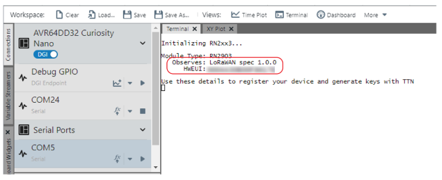

[](https://www.microchip.com)

# Agricultural IoT with the AVR64DD32 and the RN2xx3 LoRa® Module
This example shows how the AVR64DD32 can be used to create a LoRaWAN end node that monitors temperature, humidity, barometric pressure, and soil moisture and transmits that data every three minutes to an application via The Things Network (TTN).  The node can be placed anywhere between ten meters and five kilometers from a LoRaWAN gateway in urban environments, but the range is wider for suburban locations. The design demonstrates how an end node, even at long range, can be configured to consume very low power/have long battery life, while securely moving valuable data.  This design can be scaled easily to enable the capture of soil variability data by placing additional nodes throughout an agricultural plot without the need to add additional gateways or infrastructure.

This demo uses the RN2903A module which operates on the 915 MHz frequency band and is suitable for US and Australia based projects, but the project is easily adapted to work in other regions by selecting an alternate Click board™ and gateway for your region. 

## Related Documentation
- [AVR64DD32 Datasheet](https://ww1.microchip.com/downloads/aemDocuments/documents/MCU08/ProductDocuments/DataSheets/AVR64DD32-28-Prelim-DataSheet-DS40002315B.pdf)
- [AVD64DD32 Curiosity Nano Hardware User Guide](https://ww1.microchip.com/downloads/aemDocuments/documents/MCU08/ProductDocuments/UserGuides/AVR64DD32CNANO-Prel-HW-UserGuide-DS50003323.pdf)
- [Curiosity Nano Base Board Hardware User Guide](https://ww1.microchip.com/downloads/en/DeviceDoc/Curiosity-Nano-Base-for-Click-boards-User-Guide-50002839B.pdf)
- [RN2903 LoRa Technology Transceiver Module Data Sheet](https://ww1.microchip.com/downloads/en/DeviceDoc/50002390E.pdf)
- [RN2903 LoRa Technology Module Command Reference User's Guide](http://ww1.microchip.com/downloads/en/DeviceDoc/40001811A.pdf)
  
## Software Used
- [MPLAB® X IDE 6.0.0](https://www.microchip.com/en-us/tools-resources/develop/mplab-x-ide?utm_source=GitHub&utm_medium=TextLink&utm_campaign=MCU8_MMTCha_avrdd&utm_content=avr64dd32-agri-iot-mplab-mcc-github) or newer
- [MPLAB XC8 Compiler 2.40](https://www.microchip.com/en-us/tools-resources/develop/mplab-xc-compilers?utm_source=Hackster&utm_medium=TextLink&utm_campaign=MCU8_MMTCha_avrdd&utm_content=agri-iot-dd-hackster) or a newer compiler
- [MPLAB Code Configurator Melody](https://www.microchip.com/en-us/tools-resources/configure/mplab-code-configurator?utm_source=GitHub&utm_medium=TextLink&utm_campaign=MCU8_MMTCha_avrdd&utm_content=avr64dd32-agri-iot-mplab-mcc-github) v5.4.11 or newer
- [AVR-Dx Series Device Pack](https://packs.download.microchip.com/?utm_source=GitHub&utm_medium=TextLink&utm_campaign=MCU8_MMTCha_avrdd&utm_content=avr64dd32-agri-iot-mplab-mcc-github) v2.1.152 or newer
- [MPLAB Data Visualizer](https://www.microchip.com/en-us/tools-resources/debug/mplab-data-visualizer?utm_source=GitHub&utm_medium=TextLink&utm_campaign=MCU8_MMTCha_avrdd&utm_content=avr64dd32-agri-iot-mplab-mcc-github)

## Hardware Used
-  [AVR64DD32 CNano](https://www.microchipdirect.com/dev-tools/EV72Y42A?utm_source=GitHub&utm_medium=TextLink&utm_campaign=MCU8_MMTCha_avrdd&utm_content=avr64dd32-agri-iot-mplab-mcc-github)
- [Curiosity Nano Base for Click Boards](https://www.microchip.com/en-us/development-tool/AC164162?utm_source=GitHub&utm_medium=TextLink&utm_campaign=MCU8_MMTCha_avrdd&utm_content=avr64dd32-agri-iot-mplab-mcc-github)
- [MikroE LR 2 Click](https://www.mikroe.com/lr-2-click)
- [MikroE Weather Click](https://www.mikroe.com/weather-click)
- [Capacitive Soil Moisture Sensor v2.0](https://www.temu.com/capacitive-soil-moisture-sensor-corrosion-resistant-for-arduino-moisture-detection-garden-watering-diy-g-601099513086702.html?top_gallery_url=https%3A%2F%2Fimg.kwcdn.com%2Fproduct%2FFancyalgo%2FVirtualModelMatting%2Fe478408653722948efc90819fea9429f.jpg&spec_gallery_id=9033656&refer_page_sn=10009&refer_source=10022&freesia_scene=2&_oak_freesia_scene=2&search_key=Capacitive%20Soil%20Moisture%20Sensor%20Corrosion%20Resistant%20For%20Arduino%20Moisture%20Detection%20Garden%20Watering%20DIY&refer_page_el_sn=200049&_x_ads_channel=google&_x_login_type=Google&_x_vst_scene=adg&_x_ns_sku_id=17592194381424&_x_gmc_account=702222437&_x_ads_account=5532219654&_x_ads_set=19790343113&_x_ads_id=147608091340&_x_ads_creative_id=650648179894&_x_ns_source=g&_x_ns_gclid=Cj0KCQjw2cWgBhDYARIsALggUhpif-xSTewmVGq28Z8fXb4k_MhKbborDUppiGthzZasRGP_Os6m2DYaAk12EALw_wcB&_x_ns_placement=&_x_ns_match_type=&_x_ns_ad_position=&_x_ns_product_id=702222437-17592194381424&_x_ns_target=&_x_ns_devicemodel=&_x_ns_wbraid=CjkKCQjwtsCgBhCkARIoAIzGGRw9p-7usbwQAJa4palrim8IiSUGZCImpi5Uw5KSGSoknkeHexoCUKY&_x_ns_gbraid=0AAAAAo4mICG0r6cpA9ax6GllAn56PbZa4&_x_ns_targetid=pla-293946777986&_x_sessn_id=pfa2hfojbh&refer_page_name=search_result&refer_page_id=10009_1678899275345_8edtwyyd6w)
- [RAKwireless RAK Discover Kit](https://store.rakwireless.com/products/lpwan-gateway-discover-kit?variant=29470015586349)
- Jumper wires

## Setup - End Node Hardware
Add the components to the Nano Adapter board. 

Place the LR2 Click on MikroBUS™ 2 and the Weather Click on MikroBUS 1.  

Connect the moisture sensor leads as shown in Figure 1.  

Lastly, add a jumper wire between (PA1) and PD1 to allow the resetting of the LR2 Click.  (PA1) is not connected by default (since it is already connected to an external clock), as a result this project enables the PD1 pin to drive the reset signal.

| Jumper Wire | Pin |
| -------------- | ----------------- |
| VCC - Red wire from Moisture Sensor | VCC |
| GND - Black wire from Moisture Sensor | GND |
| AOUT - Yellow wire from Moisture Sensor | PD2 |
| (PA1) - Place a jumper between | PD1 |


*Figure 1. Hardware Setup*

## Setup - Software
### End Node Environment Setup
- Download, install and open MPLAB X IDE
- Download and install the XC8 C Compiler
- Open the 'avr64dd32-agri-iot-mplab-mcc.X' project as shown in Figure 2.


*Figure 2. Open the Project in MPLAB X*

Once the project has opened, begin by calibrating the sensors.
#### Calibrate the Sensors
To calibrate the moisture sensor, open the `application.c` file, and change the initial state to `TEST_MOISTURE`. 


*Figure 3. Setting the Initial State to TEST_MOISTURE*

Later these settings can be made specific to your soil and plant needs, but for brevity, begin with the upper and lower bounds for measurements by testing in dry air and in a cup of water.

Place the sensor so it is suspended in dry air.


*Figure 4. Sensor Positioned in Dry Air*

Start the Data Visualizer with the following settings:

Baud Rate: 9600

Char length: 8 bits

Parity: None

Stop Bits: 1
  
Click Send to terminal, then make and program the device.


*Figure 5. Data Visualizer Send to Terminal*


*Figure 6. Make and Program the Device*

Once the program starts, you will be prompted to press the button to generate an Analog-to-Digital Converter (ADC) read.  Press the button a few times with the sensor in dry air, then place the sensor a cup of water and press the button a few more times.

Figure 7 shows two readings. When collecting dry air samples, the ADC reading is close to 3000. When collecting water samples, the reading is close to 1400.


*Figure 7. ADC Values in Dry Air and in a Cup of Water*

Note your results and open the `application.h` file. Replace the defintions for `IN_MAX` and `IN_MIN` using your results, then use those values to calculate the `CONVERSION_PERCENT` using the formula shown.


*Figure 8. Soil Moisture Definitions*

Only one small change is needed to calibrate the Weather Click; the rest is taken care of in software.  To have an accurate pressure reading, the device needs to use your current elevation above sea level.  Enter this value on line 24 of the `bme.h` file.


*Figure 9. Elevation for Weather click*

Next, set up the TTN side of the project.
### The Things Network Application Setup
If you haven't already done so, set up an an account with TTN; the community edition is free for fair use. The account set up begins with selecting a regional cluster, click [here](https://console.cloud.thethings.network/) to get started.

After setting up your account, navigate to your console and click **Go to applications**.


*Figure 10. Application Setup*

Click the **Create application** button and follow the instructions to create an application.


*Figure 11. Create Application*

### Setup Application Uplink Payload Formatter
Click on **Payload** formatters then on **Uplink**.


*Figure 12. Application Uplink Payload Formatter*

Under Setup Formatter type*, select Custom Javascript formatter.


*Figure 13. Select Custom Javascript formatter*

Replace the default `decodeUplink` function with the following snippet:
```js
function decodeUplink(input) {
    var data = {};
    data.temp = input.bytes[0];
    data.humidity = input.bytes[1];
    data.moisture = input.bytes[2];
    data.pressure = (input.bytes[3] + 900);
    
    return {
      data: data
    };
}
```

*Figure 14. Decode Uplink Code Snippet*

Click Save and return to the overview page.

## Set up an End Device for Over the Air Activation (OTAA)
From the application overview page, click on **Register end device** button.


*Figure 15. Registering an end device for OTAA*

To register the device, a few details from the module are needed.  Open the `application.c` file again and change the state to REGISTER.


*Figure 16. Changing the state to REGISTER*

Start the Data Visualizer and build and program the device again.  When the program runs, copy the HWEUI and note the LoRaWAN spec.  



*Figure 17. End device details in Data Visualizer*

Return to the Register end device window on TTN, and select Enter end device specifics manually.  Choose your frequency plan based on your location and select the LoRaWAN specification.  In the provisioning information section, enter all zeros for the JoinEUI field, then click **Confirm**.


*Figure 18. Registering a new device*

Paste the HWEUI you copied earlier into the DEVEUI field then click **Generate** to generate a new AppKey.


*Figure 19. Generate a new AppKey*

The end device is now created and will need to have a payload formatter.

### Set up the End Device Payload Formatter
The quickest way to set up the formatter is to use the **Paste application formatter** button.  Click on the **Payload formatters button**, then select Custom javascript formatter option, and press the **Paste application formatter**.


*Figure 20. Paste the application formatter*

### Update the Project with the HWEUI and Generated App Key
On TTN, open the end device overview page, there are two fields to copy and paste into the RN2xx3 header file for the project.  Click the DevEUI and paste it into the HWEUI field in the `RN2xx3.h` definition.  Copy the AppKey field and paste it into the APPKEY definition.


*Figure 21. Copy the DevEUI and AppKey to the clipboard*


*Figure 22. Update the HWEUI and APPKEY definitions*


## Test on The Things Network
This example assumes that you either have public TTN gateway near you, or you have set one up on your own.  Having your own gateway is very helpful for troubleshooting if you run into issues.  If you want to set up your own gateway, two helpful guides can be found at: [Hackster Project](https://www.hackster.io/toby-sinkinson/agricultural-iot-with-lorawan-and-8-bit-c8daed) and [RAK Developer Gateway](https://news.rakwireless.com/basics-station-on-rak-wisgate-developer-gateways/).  

Once you have access to a gateway, continue the test by opening the `application.c` file again and changing the state back to INIT.


*Figure 23. Change back to INIT*

Start the Data Visualizer again and re-program the device.


*Figure 24. Start Data Visualizer*

When the application starts, the modules will be initialized.  Press the button to start the join TTN procedure.

Setting up the channel frequency plan will take about ten seconds to complete. Afterwards, if the join request is accepted, the device will send its first payload.  If the device does not connect, some suggestions will be given.  Common problems are being too close to a gateway, incorrect keys, or the gateway may have temporarily disconnected.  Normally, you should see an output like the one in figure 25.


*Figure 25. Output When Join Request is Accepted*

For this project, the node sends new data every three minutes. Once per day, it sends the data as a confirmed payload as in this first transmission. Confirmed messages require an acknowledgment from the network, but also consume airtime on the gateway and extra battery life for the node. So the next 479 messages each day are sent as unconfirmed messages. 

This project sends all confirmed messages on port 10 and unconfirmed messages on port 11. You can see in Figure 26 below showing the application live data window, that after joining and sending an initial confirmed message, the node subsequently sends an unconfirmed message to the application every three minutes.


*Figure 26. Confirmed Messages on Port 10 and Unconfirmed Messages on Port 11*
## Summary
This example shows how to set up a LoRaWAN end node using the AVR64DD32 with the MikroE LR2 Click, the MikroE Weather Click and a soil moisture sensor to share soil conditions at long range using low power.